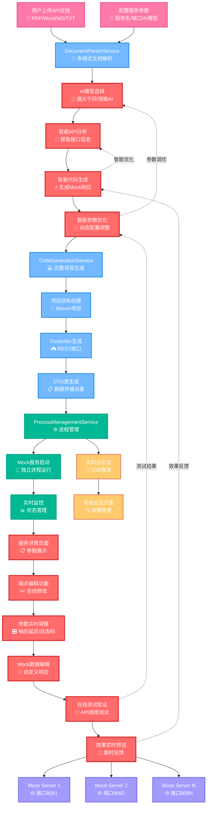

# Das Mock Server 整体业务流程图

## 核心业务流程 - 突出AI能力

## AI能力详细说明

### 🧠 智能API分析能力
- **文档理解**: 自动解析API文档中的接口定义、参数说明、响应格式
- **语义提取**: 智能识别RESTful API的路径、方法、参数类型
- **关系映射**: 自动建立接口间的依赖关系和数据结构

### ⚡ 智能代码生成能力
- **模板适配**: 根据API特点自动选择合适的代码模板
- **响应生成**: 基于接口描述智能生成真实的Mock响应数据
- **类型推断**: 自动推断参数类型并生成对应的Java类

### 🎯 智能参数优化能力
- **模型选择**: 支持多种AI模型（通义千问、恒脑AI）动态切换
- **参数调优**: 智能调整temperature、maxTokens等AI参数
- **性能优化**: 根据文档复杂度自动优化生成策略

### 🔄 智能反馈循环
- **质量评估**: 自动评估生成的代码质量和完整性
- **迭代优化**: 基于生成结果自动优化后续的生成策略
- **错误修复**: 智能识别和修复常见的代码生成问题

### 🎛️ 在线调优能力
- **实时参数调整**: 支持在线修改响应延迟、状态码、Mock数据
- **可视化编辑**: 提供友好的Web界面进行参数配置
- **即时测试验证**: 支持在线调用API验证生成效果
- **智能建议**: 基于测试结果提供参数优化建议

## 技术架构亮点

### 1. 多AI模型支持
- 阿里云通义千问：通用AI能力
- 恒脑AI：专业代码生成
- 动态模型切换：根据需求选择最优模型

### 2. 智能文档解析
- 支持PDF、Word、Markdown、TXT多种格式
- 自动提取结构化信息
- 智能处理表格、图片等复杂内容

### 3. 实时监控体系
- Server-Sent Events (SSE) 实时日志推送
- 进程状态实时监控
- 智能故障诊断和告警

### 4. 微服务架构
- 每个Mock服务独立运行
- 动态端口分配
- 进程级隔离和管理

### 5. 在线调优系统
- 实时参数编辑：支持响应延迟、状态码、Mock数据在线修改
- 可视化测试：提供API调用测试界面，实时验证效果
- 智能反馈：基于测试结果提供优化建议
- 版本管理：支持参数配置的保存和回滚

## 业务价值

### 🚀 开发效率提升
- **自动化程度**: 从文档到可运行服务，全流程自动化
- **时间节省**: 传统需要数小时的Mock服务搭建，现在仅需几分钟
- **质量保证**: AI生成的代码结构规范，减少人工错误

### 🎯 智能化程度
- **自适应生成**: 根据文档特点自动调整生成策略
- **持续优化**: 基于使用反馈不断优化生成质量
- **多场景支持**: 支持各种类型的API文档和业务场景

### 💡 创新特性
- **AI驱动**: 核心能力完全基于AI技术
- **实时交互**: 支持实时日志查看和问题排查
- **可扩展性**: 支持多种AI模型和文档格式扩展
- **在线调优**: 提供完整的在线参数调整和效果验证闭环

## 在线调优详细流程

### 📋 服务详情展示

### ✏️ 端点编辑功能
- **路径修改**: 支持RESTful路径的在线编辑
- **方法调整**: 支持HTTP方法的动态切换
- **参数配置**: 支持请求参数和响应参数的详细配置
- **认证设置**: 支持多种认证方式的配置

### 🎛️ 实时参数调整
- **响应延迟**: 模拟网络延迟，支持0-10秒可调
- **状态码**: 支持200、400、500等常见状态码设置
- **Mock数据**: 支持JSON格式的响应数据在线编辑
- **请求体**: 支持请求参数的在线配置和验证

### 🧪 在线测试验证
- **API调用**: 提供内置的API测试工具
- **响应预览**: 实时显示API调用结果
- **性能测试**: 支持并发调用和性能指标展示
- **错误诊断**: 自动识别和提示常见错误

### 👀 效果实时预览
- **即时反馈**: 参数修改后立即生效
- **对比展示**: 支持修改前后的效果对比
- **历史记录**: 保存参数修改历史，支持回滚
- **智能建议**: 基于测试结果提供优化建议
